## Package dependencies

Make sure we have the packages we need, and install them if they are missing.


```r
packages <- c("ggplot2", "dplyr", "lavaan", "plyr", "cowplot", "rmarkdown", 
              "readr", "caTools", "bitops")

if (length(setdiff(packages, rownames(installed.packages()))) > 0) {
  install.packages(setdiff(packages, rownames(installed.packages())))  
}
```

## How to make it rain
This tutorial will walk you through the process of transforming your barplots into rainclouds, and also show you how to customize your rainclouds for various options such as ordinal or repeated measures data.

If you'd like to see this notebook with the output rendered, checkout [raincloud_tutorial_r.md](https://github.com/RainCloudPlots/RainCloudPlots/blob/master/tutorial_R/raincloud_tutorial_r.md) or [raincloud_tutorial_r.pdf](https://github.com/RainCloudPlots/RainCloudPlots/blob/master/tutorial_R/raincloud_tutorial_r.pdf).

First, we'll run the included "R_rainclouds" script, which will set-up the split-half violin option in ggplot, as well as simulate some data for our figures:


```r
library(cowplot)
library(dplyr)
library(readr)

source("R_rainclouds.R")
source("summarySE.R")
source("simulateData.R")

# width and height variables for saved plots
w = 6
h = 3
# Make the figure folder if it doesn't exist yet
dir.create('../figs/tutorial_R/', showWarnings = FALSE)

head(summary_simdat)
```

```
##    group   N score_mean score_median       sd       se       ci
## 1 Group1 250   49.45877     42.74587 25.27975 1.598832 3.148958
## 2 Group2 250   51.94353     52.69956 25.06328 1.585141 3.121994
```

The function gives us two groups of N = 250 observations each; both have similar means and SDs, but group one is drawn from an exponential distribution. Now we'll plot a basic barplot for our simulated date. Note that we're using the 'cowplot' theme to produce simple, uncluttered plots - you should setup your own theme or other customization options as desired:


```r
#Barplot
p1 <- ggplot(summary_simdat, aes(x = group, y = score_mean, fill = group))+
  geom_bar(stat = "identity", width = .8)+
  geom_errorbar(aes(ymin = score_mean - se, ymax = score_mean+se), width = .2)+
  guides(fill=FALSE)+
  ylim(0, 80)+
  ylab('Score')+xlab('Group')+theme_cowplot()+
  ggtitle("Figure 1: Barplot +/- SEM")

ggsave('../figs/tutorial_R/1Barplot.png', width = w, height = h)
```

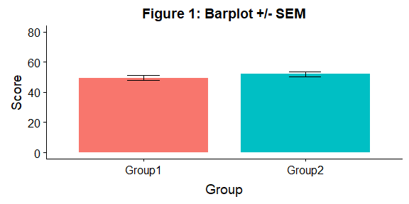<!-- -->

There we go - just needs some little asterixes and we're ready to publish! Just kidding. Let's start our first, most basic raincloud plot like so, using the 'geom_flat_violin' option our function already setup for us:


```r
#Basic plot
p2 <- ggplot(simdat,aes(x=group,y=score))+
  geom_flat_violin(position = position_nudge(x = .2, y = 0),adjust =2)+
  geom_point(position = position_jitter(width = .15), size = .25)+
  ylab('Score')+xlab('Group')+theme_cowplot()+
  ggtitle('Figure 2: Basic Rainclouds or Little Prince Plot')

ggsave('../figs/tutorial_R/2basic.png', width = w, height = h)
```

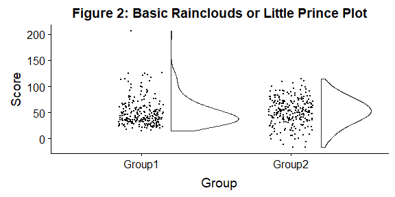<!-- -->

Now we can see the raw data (our 'rain'), and the overlaid probability distribution (the 'cloud'). Let's make it a bit prettier and easier to read by adding some colours. We can also use 'coordinate flip' to rotate the entire plot about the x-axis, transforming our 'little prince plots' into true rainclouds:


```r
#Plot with colours and coordinate flip
p3 <- ggplot(simdat,aes(x=group,y=score, fill = group))+
  geom_flat_violin(position = position_nudge(x = .2, y = 0),adjust = 2)+
  geom_point(position = position_jitter(width = .15), size = .25)+
  ylab('Score')+xlab('Group')+coord_flip()+theme_cowplot()+guides(fill = FALSE)+
  ggtitle('Figure 3: The Basic Raincloud with Colour')

ggsave('../figs/tutorial_R/3pretty.png', width = w, height = h)
```

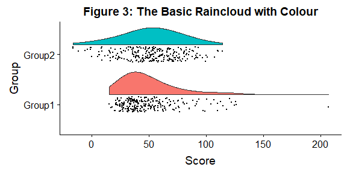<!-- -->

In case you want to change the smoothing kernel used to calculate the PDFs, you can do so by altering the 'adjust' flag for geom_flat_violin. For example, here we've dropped our smoothing to give a much bumpier raincloud:


```r
#Raincloud with reduced smoothing
p4 <- ggplot(simdat,aes(x=group,y=score, fill = group))+
  geom_flat_violin(position = position_nudge(x = .2, y = 0),adjust = .2)+
  geom_point(position = position_jitter(width = .15), size = .25)+
  ylab('Score')+xlab('Group')+coord_flip()+theme_cowplot()+guides(fill = FALSE) +
  ggtitle('Figure 4: Unsmooth Rainclouds')

ggsave('../figs/tutorial_R/4unsmooth.png', width = w, height = h)
```

<!-- -->

Now we need to add something to help us easily evaluate any possible differences between our groups or conditions. To achieve this, we'll add some boxplots to complete our raincloud plots. To get the boxplots to line up however we like, we need to set our x-axis to a numeric value, so we can add a fixed offset: 


```r
#Rainclouds with boxplots
p5 <- ggplot(simdat,aes(x=group,y=score, fill = group))+
  geom_flat_violin(position = position_nudge(x = .25, y = 0),adjust =2)+
  geom_point(position = position_jitter(width = .15), size = .25)+
#note that here we need to set the x-variable to a numeric variable and bump it to get the boxplots to line up with the rainclouds. 
  geom_boxplot(aes(x = as.numeric(group)+0.25, y = score),outlier.shape = NA, alpha = 0.3, width = .1, colour = "BLACK") +
  ylab('Score')+xlab('Group')+coord_flip()+theme_cowplot()+guides(fill = FALSE, colour = FALSE) +
  ggtitle("Figure 5: Raincloud Plot w/Boxplots")

ggsave('../figs/tutorial_R/5boxplots.png', width = w, height = h)
```

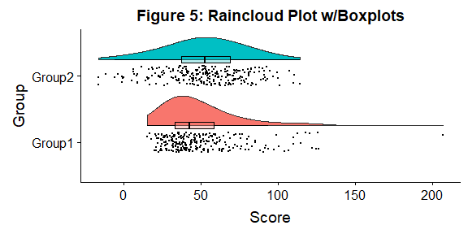<!-- -->

Now we'll make a few aesthetic tweaks. You may want to turn these on or off depending on your preferences. We'll take the black outline away from the plots by adding the colour = group parameter, and we'll also change colour palettes using the built-in colour brewer tool. 


```r
#Rainclouds with boxplots
p6 <- ggplot(simdat,aes(x=group,y=score, fill = group, colour = group))+
  geom_flat_violin(position = position_nudge(x = .25, y = 0),adjust =2, trim = FALSE)+
  geom_point(position = position_jitter(width = .15), size = .25)+
  geom_boxplot(aes(x = as.numeric(group)+0.25, y = score),outlier.shape = NA, alpha = 0.3, width = .1, colour = "BLACK") +
  ylab('Score')+xlab('Group')+coord_flip()+theme_cowplot()+guides(fill = FALSE, colour = FALSE) +
  scale_colour_brewer(palette = "Dark2")+
  scale_fill_brewer(palette = "Dark2")+
  ggtitle("Figure 6: Change in Colour Palette")

ggsave('../figs/tutorial_R/6boxplots.png', width = w, height = h)
```

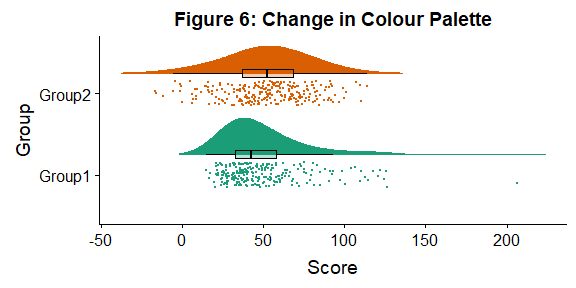<!-- -->

Alternatively, you may prefer to simply plot mean or median with standard confidence intervals. Here we'll plot the mean as well as 95% confidence intervals, which we've calculated using the included SummarySE function, by overlaying them on of our clouds:


```r
#Rainclouds with mean and confidence interval
p7 <- ggplot(simdat,aes(x=group,y=score, fill = group, colour = group))+
  geom_flat_violin(position = position_nudge(x = .25, y = 0),adjust =2)+
  geom_point(position = position_jitter(width = .15), size = .25)+
  geom_point(data = summary_simdat, aes(x = group, y = score_mean), position = position_nudge(.25), colour = "BLACK")+
  geom_errorbar(data = summary_simdat, aes(x = group, y = score_mean, ymin = score_mean-ci, ymax = score_mean+ci), position = position_nudge(.25), colour = "BLACK", width = 0.1, size = 0.8)+
  ylab('Score')+xlab('Group')+coord_flip()+theme_cowplot()+guides(fill = FALSE, colour = FALSE) +
  scale_colour_brewer(palette = "Dark2")+
  scale_fill_brewer(palette = "Dark2")+
  ggtitle("Figure 7: Raincloud Plot with Mean ± 95% CI")

ggsave('../figs/tutorial_R/7meanplot.png', width = w, height = h)
```

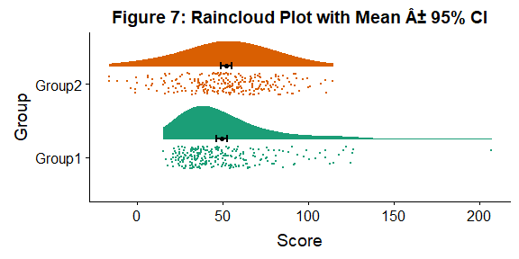<!-- -->

If your data is discrete or ordinal you may need to manually add some jitter to improve the plot:


```r
#Rainclouds with striated data

#Round data
simdat_round<-simdat
simdat_round$score<-round(simdat$score,0) 

#Striated/grouped when no jitter applied
ap1 <- ggplot(simdat_round,aes(x=group,y=score,fill=group,col=group))+
    geom_flat_violin(position = position_nudge(x = .2, y = 0), alpha = .6,adjust =4)+
    geom_point(size = 1, alpha = 0.6)+ylab('Score')+
    scale_fill_brewer(palette = "Dark2")+
    scale_colour_brewer(palette = "Dark2")+
    guides(fill = FALSE, col = FALSE)+
    ggtitle('Striated')

#Added jitter helps
ap2 <- ggplot(simdat_round,aes(x=group,y=score,fill=group,col=group))+
    geom_flat_violin(position = position_nudge(x = .2, y = 0), alpha = .4,adjust =4)+
    geom_point(position=position_jitter(width = .15),size = 1, alpha = 0.4)+ylab('Score')+
    scale_fill_brewer(palette = "Dark2")+
    scale_colour_brewer(palette = "Dark2")+
    guides(fill = FALSE, col = FALSE)+
    ggtitle('Added jitter')

all_plot <- plot_grid(ap1, ap2, labels="AUTO")

# add title to cowplot
title <- ggdraw() + 
  draw_label("Figure 8: Jittering Ordinal Data",
             fontface = 'bold')

all_plot_final <- plot_grid(title, all_plot, ncol = 1, rel_heights = c(0.1, 1)) # rel_heights values control title margins

ggsave('../figs/tutorial_R/8allplot.png', width = w, height = h)
```

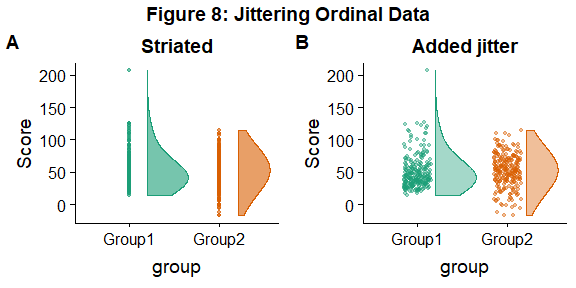<!-- -->

Finally, in many situations you may have nested, factorial, or repeated measures data. In this case, one option is to use plot facets to group by factor, emphasizing pairwise differences between conditions or factor levels:


```r
#Add additional factor/condition
simdat$gr2<-as.factor(c(rep('high',125),rep('low',125),rep('high',125),rep('low',125)))


p9 <- ggplot(simdat,aes(x=group,y=score, fill = group, colour = group))+
  geom_flat_violin(position = position_nudge(x = .25, y = 0),adjust =2, trim = TRUE)+
  geom_point(position = position_jitter(width = .15), size = .25)+
  geom_boxplot(aes(x = as.numeric(group)+0.25, y = score),outlier.shape = NA, alpha = 0.3, width = .1, colour = "BLACK") +
  ylab('Score')+xlab('Group')+coord_flip()+theme_cowplot()+guides(fill = FALSE, colour = FALSE) + facet_wrap(~gr2)+
  scale_colour_brewer(palette = "Dark2")+
  scale_fill_brewer(palette = "Dark2")+
  ggtitle("Figure 9: Complex Raincloud Plots with Facet Wrap")

ggsave('../figs/tutorial_R/9facetplot.png', width = w, height = h)
```

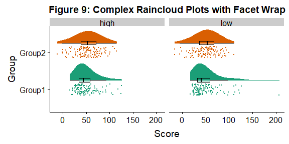<!-- -->

As another example, we consider some simulated repeated measures data in factorial design, where two groups are measured across three timepoints. To do so, we'll first load in some new data:


```r
#load the repeated measures facotiral data

rep_data <- read_csv("repeated_measures_data.csv", 
    col_types = cols(group = col_factor(levels = c("1", 
        "2")), time = col_factor(levels = c("1", 
        "2", "3"))))

sumrepdat <- summarySE(rep_data, measurevar = "score", groupvars=c("group", "time"))


head(sumrepdat)
```

```
##   group time  N score_mean score_median       sd        se        ci
## 1     1    1 18   6.362222        6.670 1.658861 0.3909972 0.8249319
## 2     1    2 18   7.468333        7.730 1.546880 0.3646032 0.7692454
## 3     1    3 18  10.482778       10.455 1.060254 0.2499043 0.5272520
## 4     2    1 11   1.847273        1.210 2.010279 0.6061219 1.3505238
## 5     2    2 11   3.684545        2.920 2.135108 0.6437594 1.4343852
## 6     2    3 11   7.358182        7.020 2.236273 0.6742616 1.5023486
```

Now, we'll plot our rainclouds with boxplots again, this time adding some dodge so we can better emphasize differences between our factors and factor levels. Note that here we need to nudge the point x-axis as a numeric valuable, as this work around does not currently work for boxplots with multiple factors:


```r
# Rainclouds for repeated measures, continued 
p10 <- ggplot(rep_data, aes(x = time, y = score, fill = group)) +
  geom_flat_violin(aes(fill = group),position = position_nudge(x = .1, y = 0), adjust = 1.5, trim = FALSE, alpha = .5, colour = NA)+
  geom_point(aes(x = as.numeric(time)-.15, y = score, colour = group),position = position_jitter(width = .05), size = 1, shape = 20)+
  geom_boxplot(aes(x = time, y = score, fill = group),outlier.shape = NA, alpha = .5, width = .1, colour = "black")+
  scale_colour_brewer(palette = "Dark2")+
  scale_fill_brewer(palette = "Dark2")+
  ggtitle("Figure 10: Repeated Measures Factorial Rainclouds")

ggsave('../figs/tutorial_R/10repanvplot.png', width = w, height = h)
```

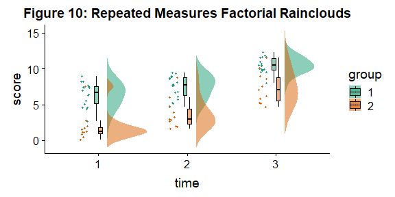<!-- -->

Finally, you may want to add traditional line plots to emphasize factorial interactions and main effects. Here we've plotted the mean and standard error for each cell of our design, and connected these with a hashed line. There are a lot of possible options though, so you'll need to decide what works best for your needs: 


```r
#Rainclouds for repeated measures, additional plotting options 

p11 <- ggplot(rep_data, aes(x = time, y = score, fill = group)) +
  geom_flat_violin(aes(fill = group),position = position_nudge(x = .1, y = 0), adjust = 1.5, trim = FALSE, alpha = .5, colour = NA)+
  geom_point(aes(x = as.numeric(time)-.15, y = score, colour = group),position = position_jitter(width = .05), size = .25, shape = 20)+
  geom_boxplot(aes(x = time, y = score, fill = group),outlier.shape = NA, alpha = .5, width = .1, colour = "black")+
  geom_line(data = sumrepdat, aes(x = as.numeric(time)+.1, y = score_mean, group = group, colour = group), linetype = 3)+
  geom_point(data = sumrepdat, aes(x = as.numeric(time)+.1, y = score_mean, group = group, colour = group), shape = 18) +
  geom_errorbar(data = sumrepdat, aes(x = as.numeric(time)+.1, y = score_mean, group = group, colour = group, ymin = score_mean-se, ymax = score_mean+se), width = .05)+
  scale_colour_brewer(palette = "Dark2")+
  scale_fill_brewer(palette = "Dark2")+
  ggtitle("Figure 11: Repeated Measures - Factorial (Extended)")

ggsave('../figs/tutorial_R/11repanvplot2.png', width = w, height = h)
```

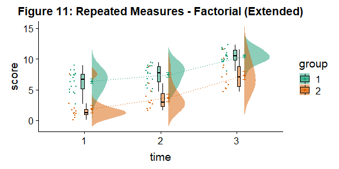<!-- -->

Here is the same plot, but with the grouping variable flipped: 


```r
#Rainclouds for repeated measures, additional plotting options 

p12 <- ggplot(rep_data, aes(x = group, y = score, fill = time)) +
  geom_flat_violin(aes(fill = time),position = position_nudge(x = .1, y = 0), adjust = 1.5, trim = FALSE, alpha = .5, colour = NA)+
  geom_point(aes(x = as.numeric(group)-.15, y = score, colour = time),position = position_jitter(width = .05), size = .25, shape = 20)+
  geom_boxplot(aes(x = group, y = score, fill = time),outlier.shape = NA, alpha = .5, width = .1, colour = "black")+
  geom_line(data = sumrepdat, aes(x = as.numeric(group)+.1, y = score_mean, group = time, colour = time), linetype = 3)+
  geom_point(data = sumrepdat, aes(x = as.numeric(group)+.1, y = score_mean, group = time, colour = time), shape = 18) +
  geom_errorbar(data = sumrepdat, aes(x = as.numeric(group)+.1, y = score_mean, group = time, colour = time, ymin = score_mean-se, ymax = score_mean+se), width = .05)+
  scale_colour_brewer(palette = "Dark2")+
  scale_fill_brewer(palette = "Dark2")+
  ggtitle("Figure 12: Repeated Measures - Factorial (Extended)") +
  coord_flip()

ggsave('../figs/tutorial_R/12repanvplot3.png', width = w, height = h)
```

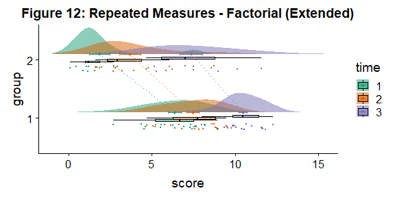<!-- -->


That's it! We hope you'll be able to use this tutorial to find great illustrations for your data, and that we've given you an idea of some of the different ways you can customize your raincloud plots.
